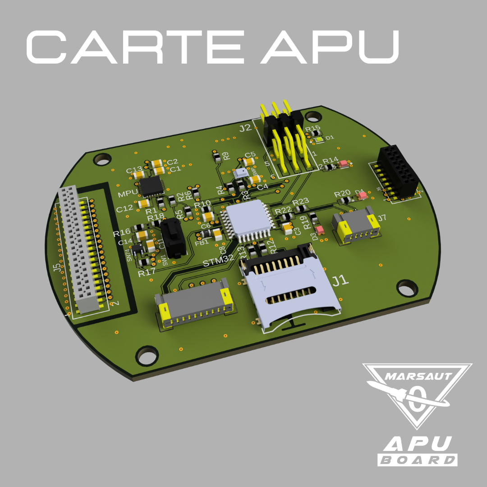
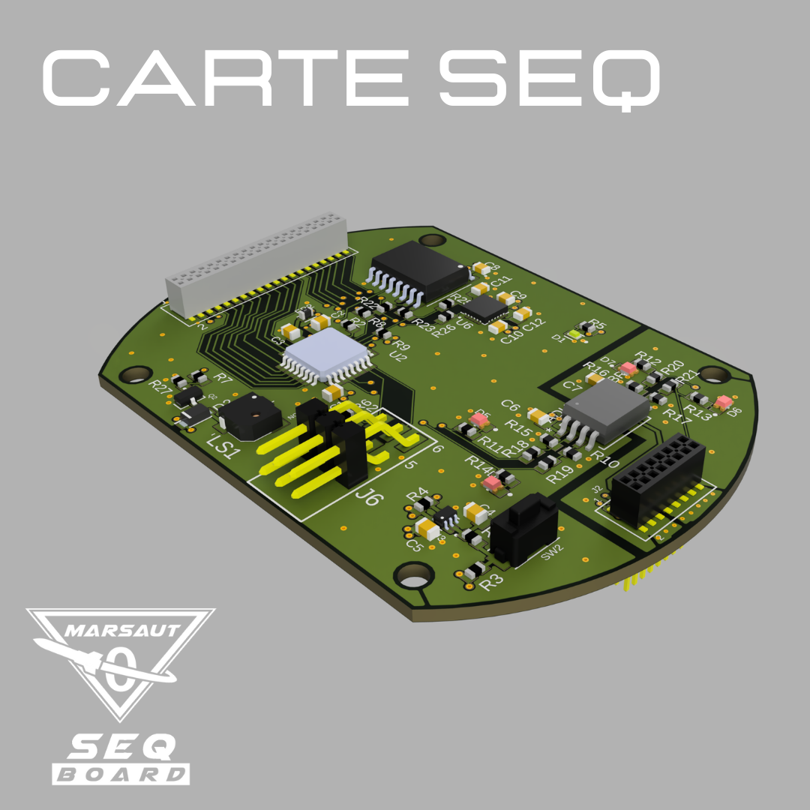
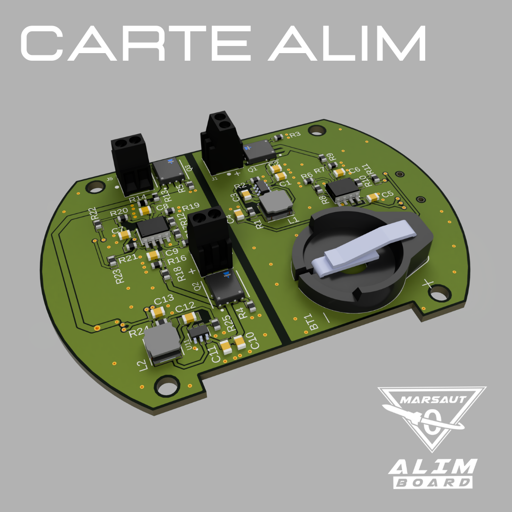
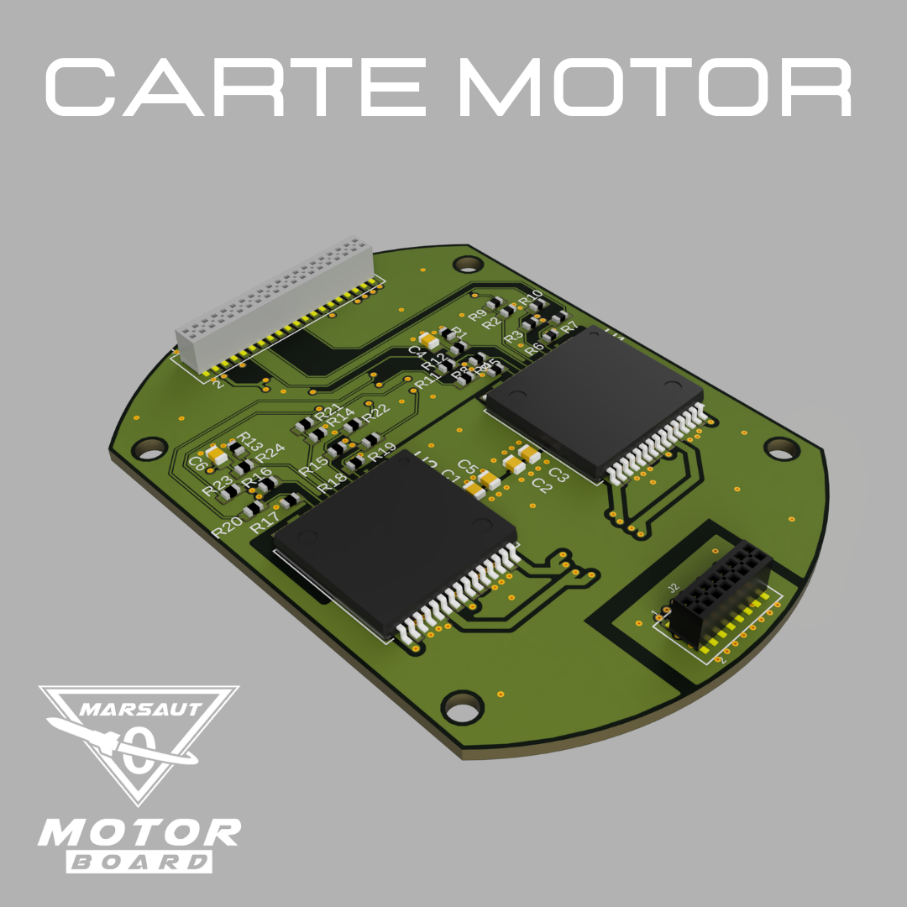
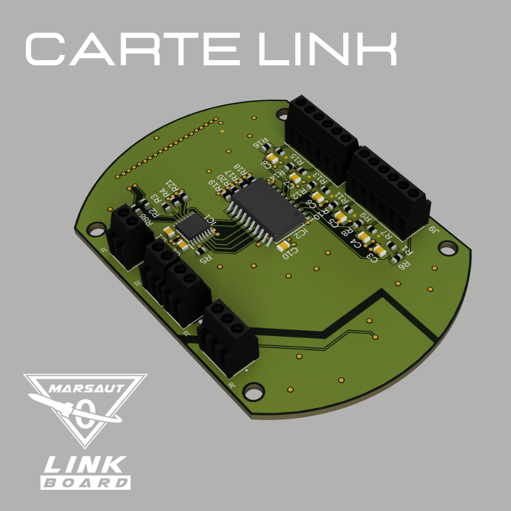

# Avionic Marsaut 0

> *© 2021 Paul Miailhe, all rights reserved.*  
> *Material licensed under [→ CC BY-NC-SA 4.0](https://creativecommons.org/licenses/by-nc-sa/4.0)*

## Experimental Rocket Avionics for Marsaut 0

The **Marsaut 0 avionics system**, designed and developed by Paul Miailhe in 2021, was successfully launched during the C'Space event. This project is licensed under **CC BY-NC-SA 4.0**.

The avionics system is based on an **STM32F303K8** microcontroller, which provides high-performance real-time control for the rocket's systems. It integrates essential sensors, motor drivers, and interface boards to ensure a robust and reliable solution for experimental rocketry.

You can access the CAD designs for all the boards [here on GrabCAD](https://grabcad.com/library/avionics-system-for-marsaut-0-rocket-mines-space-1).

---

## System Overview

The electronic architecture of the rocket is divided into the following branches:

---

- **Branch APU** (Acquisition Process Unit):  
  Responsible for acquiring, storing, and transmitting data, equipped with:  
  - **MPU6050**: A 6-axis gyroscope and accelerometer for attitude measurement.  
  - **BMP280**: A barometric pressure sensor for altitude estimation.

  

---

- **Branch SEQ** (Flight Controller):  
  The core control board, based on the **STM32F303K8**, which manages actuators and flight status monitoring.

  

  

---

- **Branch ALIM** (Power Supply):  
  Handles power distribution and monitors the battery's state of charge.
  
  

  

---

- **Branch MOTOR**:  
  Includes two **VNH5019 motor drivers** (by STMicroelectronics) for controlling the parachute deployment system.

  

  

---

- **Branch LINK**:  
  Connects all actuators and sensors in the rocket to the avionics for seamless operation.

    

  

---

- **Branch HMI** (Human-Machine Interface):  
  Provides a user interface for controlling the system and displaying key information.

---

- **Branch INT_LTS**:  
  Serves as the interface for integrating the **LoRa TTGO-T BEAM** communication module.

---

## Key Components

### **Microcontroller**
- **STM32F303K8**:  
  - ARM Cortex-M3 core with floating-point unit (FPU).  
  - Provides real-time control and data processing capabilities.

### **Sensors**
- **MPU6050**:  
  - A 6-axis IMU for measuring acceleration and angular velocity.  
  - Enables precise attitude and motion tracking.
- **BMP280**:  
  - A barometric pressure sensor for accurate altitude estimation.

### **Motor Drivers**
- **VNH5019** (by STMicroelectronics):  
  - High-power motor drivers capable of handling currents up to 12A.  
  - Used to control the parachute deployment mechanism with precision.

---

## Features and Applications

- **Real-time Control**:  
  The STM32F303K8 ensures smooth operation of actuators and sensors.  

- **Integrated Sensors**:  
  MPU6050 and BMP280 provide reliable data for navigation and altitude tracking.

- **High-Performance Motor Control**:  
  The VNH5019 motor drivers ensure precise parachute deployment and safety.

- **Seamless Communication**:  
  LoRa TTGO-T BEAM module enables efficient data transmission to ground stations.

---

## Visual Overview

### Avionics System CAD
You can find the full CAD designs of the avionics system on [GrabCAD](https://grabcad.com/library/avionics-system-for-marsaut-0-rocket-mines-space-1).

### Images

